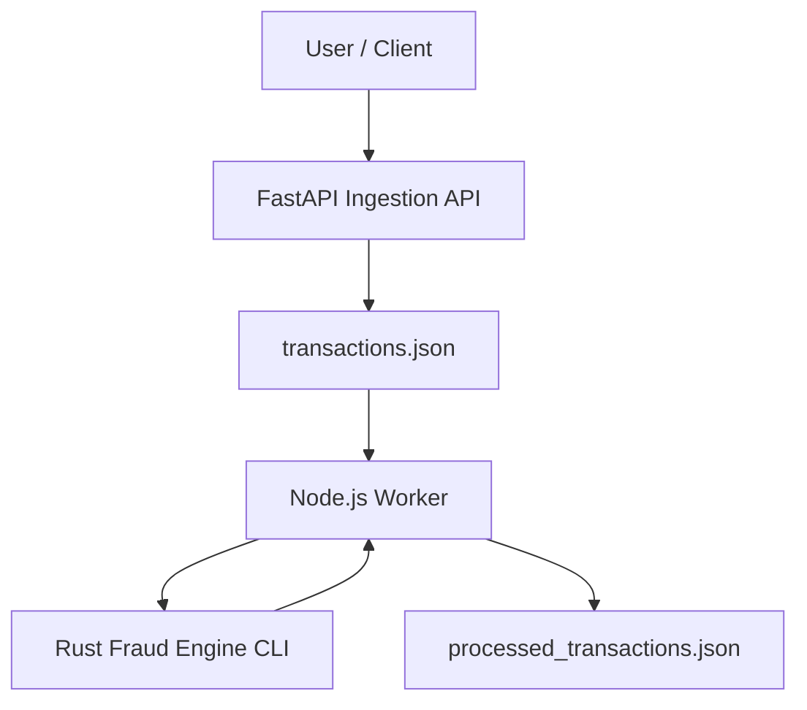
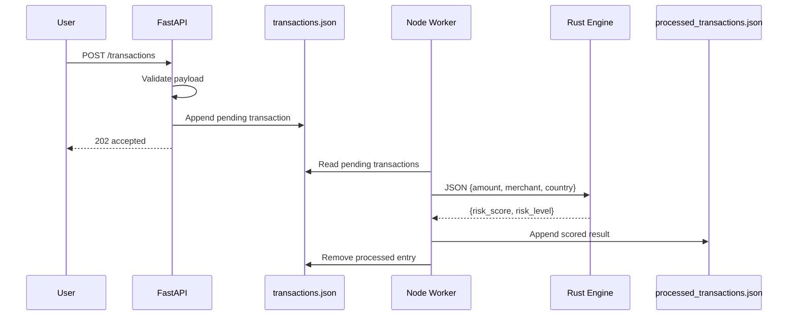

# A3 Architecture

## System overview

The A3 polyglot fraud system ingests transactions via a FastAPI HTTP API, queues them in a JSON file, processes them with a Node.js worker that calls a Rust scoring CLI, and writes scored results to a second JSON file.

## Components

### FastAPI ingestion service (`fastapi-service/`)

**Responsibilities:**

- Expose `POST /transactions` and `GET /health`
- Validate request payloads (Pydantic)
- Append validated transactions to the file queue with `status: pending`
- Return `202 Accepted` with transaction ID

**Does not:** score risk, run background workers, or connect to external brokers.

### Node.js worker (`node-worker/`)

**Responsibilities:**

- Poll `transactions.json` for pending entries
- Invoke Rust CLI via `child_process.spawnSync`
- Handle malformed records (skip + log)
- Append scored results to `processed_transactions.json`
- Remove processed items from the queue

**Modes:** continuous polling (`npm start`) or single cycle (`npm run worker:once`).

### Rust fraud engine (`rust-engine/`)

**Responsibilities:**

- Accept JSON on stdin or as CLI argument
- Apply deterministic scoring rules
- Emit JSON `{ risk_score, risk_level }`

**Does not:** read queue files or perform I/O beyond stdin/stdout.

## Data flow

## File queue design

| File | Format | Writer | Reader |
|------|--------|--------|--------|
| `shared/data/transactions.json` | JSON array | FastAPI | Node worker |
| `shared/data/processed_transactions.json` | JSON array | Node worker | Clients / tests |

Paths are configurable via environment variables for testing.

## Cross-language contract

Shared JSON schemas in `shared/`:

- `transaction-schema.json` — ingestion payload
- `score-schema.json` — Rust engine output

Node passes a subset of transaction fields to Rust. See `docs/DATA_CONTRACT.md`.

## Deployment notes

This is a **local/dev mini-system**. For production you would replace file queues with a message broker, add locking, and containerize each service.
