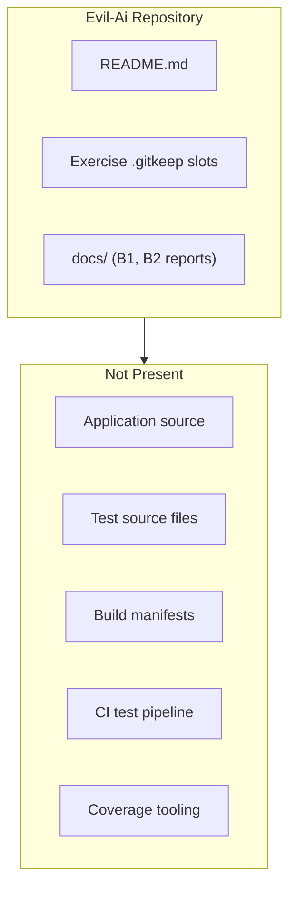

# B3 — Test Discovery and Execution Report

**Repository:** `Evil-Ai` (Eval AI Agent scaffold)  
**Scan date:** 2026-06-17  
**Task output:** `beginner/B3-test-discovery/`  
**Working directory:** `/Users/shaikdadapeer/Evil-Ai`

---

## Executive Summary

A full recursive scan of the repository found **no test framework**, **no build tool configuration**, **no test source files**, and **no executable test suite**. Standard test commands were attempted from the repository root; all failed before any tests could be collected or run.

| Metric | Value |
|--------|-------|
| Total test files | **0** |
| Total test cases run | **0** |
| Framework used | **None detected** |
| Primary command attempted | `npm test` (no `package.json`) |
| **Result** | **N/A — no test suite present** |
| Confidence level | **Confirmed** |

---

## Test Framework Discovery

| Attribute | Finding |
|-----------|---------|
| **Framework name** | None detected |
| **Version** | N/A |
| **Configuration file path** | None (`pytest.ini`, `jest.config.*`, `vitest.config.*`, `pom.xml`, `build.gradle`, `Cargo.toml`, `go.mod`, `pyproject.toml` — all absent) |
| **Build tool** | None detected |

### Framework probe results

| Framework | Config / marker searched | Found |
|-----------|-------------------------|-------|
| pytest (Python) | `pytest.ini`, `pyproject.toml`, `conftest.py`, `test_*.py`, `*_test.py` | No |
| Jest / Vitest (Node) | `package.json`, `jest.config.*`, `vitest.config.*`, `*.test.js`, `*.spec.ts` | No |
| JUnit / Maven (Java) | `pom.xml`, `src/test/java/**` | No |
| Gradle (Java/Kotlin) | `build.gradle`, `build.gradle.kts`, `src/test/**` | No |
| Cargo (Rust) | `Cargo.toml`, `tests/**` | No |
| Go test | `go.mod`, `*_test.go` | No |
| Playwright / Cypress (E2E) | `playwright.config.*`, `cypress.config.*` | No |

### Evidence — scaffold-only repository

Prior B1 scan documented no test artifacts:

```120:120:beginner/B1-repo-artifact-inventory/REPORT.md
5. **No tests.** No test directories or test source files detected.
```

`.gitignore` references test-related paths but no corresponding files exist on disk:

```27:28:.gitignore
.pytest_cache/
```

```40:40:.gitignore
coverage/
```

---

## Test Configuration Files

No test configuration files were discovered.

| File name | Path | Purpose |
|-----------|------|---------|
| — | — | — |

---

## Relevant Test Files

No unit, integration, functional, or E2E test files were found.

| Test file name | Path | Test type | Module covered |
|----------------|------|-----------|----------------|
| — | — | — | — |

### Test categories scanned

| Category | Patterns / locations | Count |
|----------|---------------------|------:|
| Unit tests | `**/test/**`, `**/*Test.java`, `**/*_test.py`, `**/*.test.ts` | 0 |
| Integration tests | `**/integration/**`, `**/*IT.java`, `**/integration_test/**` | 0 |
| Functional tests | `**/functional/**`, `**/tests/functional/**` | 0 |
| E2E tests | `**/e2e/**`, `playwright/**`, `cypress/**` | 0 |
| Test resources | `**/test/resources/**`, `**/fixtures/**`, `**/__fixtures__/**` | 0 |
| Test utilities | `**/test-utils/**`, `conftest.py`, `testHelpers/**` | 0 |

---

## Exact Commands Used

Because no project-specific test entry point was discovered, the following **standard discovery commands** were executed from the repository root to verify absence of a runnable suite.

### Command 1 — pytest (CLI)

```bash
cd /Users/shaikdadapeer/Evil-Ai && pytest
```

### Command 2 — pytest (Python module)

```bash
cd /Users/shaikdadapeer/Evil-Ai && python3 -m pytest
```

### Command 3 — npm test

```bash
cd /Users/shaikdadapeer/Evil-Ai && npm test
```

### Command 4 — Maven

```bash
cd /Users/shaikdadapeer/Evil-Ai && mvn test
```

### Command 5 — Cargo

```bash
cd /Users/shaikdadapeer/Evil-Ai && cargo test
```

### Command 6 — Go

```bash
cd /Users/shaikdadapeer/Evil-Ai && go test ./...
```

---

## Execution Results

### Summary table

| Command | Exit code | Execution time | Tests run | Passed | Failed | Skipped |
|---------|----------:|---------------:|----------:|-------:|-------:|--------:|
| `pytest` | 127 | ~0.001s | 0 | 0 | 0 | 0 |
| `python3 -m pytest` | 1 | ~0.092s | 0 | 0 | 0 | 0 |
| `npm test` | 254 | ~0.996s | 0 | 0 | 0 | 0 |
| `mvn test` | 127 | ~0.002s | 0 | 0 | 0 | 0 |
| `cargo test` | 101 | ~0.556s | 0 | 0 | 0 | 0 |
| `go test ./...` | 127 | ~0.001s | 0 | 0 | 0 | 0 |

**Note:** Exit codes reflect **tooling / project absence**, not test assertion failures. Zero test cases were collected or executed.

---

## Actual Command Output

### `pytest`

```
(eval):1: command not found: pytest
EXIT:127
```

**Fact:** `pytest` is not available on `PATH` in the execution environment.

---

### `python3 -m pytest`

```
/Library/Developer/CommandLineTools/usr/bin/python3: No module named pytest
EXIT:1
```

**Fact:** Python 3 is present; `pytest` is not installed.

---

### `npm test`

```
npm warn Unknown env config "devdir". This will stop working in the next major version of npm.
npm error code ENOENT
npm error syscall open
npm error path /Users/shaikdadapeer/Evil-Ai/package.json
npm error errno -2
npm error enoent Could not read package.json: Error: ENOENT: no such file or directory, open '/Users/shaikdadapeer/Evil-Ai/package.json'
npm error enoent This is related to npm not being able to find a file.
npm error enoent
EXIT:254
```

**Fact:** No `package.json` exists; npm cannot determine a test script.

---

### `mvn test`

```
(eval):1: command not found: mvn
EXIT:127
```

**Fact:** Maven is not available on `PATH`; no `pom.xml` exists in the repository.

---

### `cargo test`

```
error: could not find `Cargo.toml` in `/Users/shaikdadapeer/Evil-Ai` or any parent directory
EXIT:101
```

**Fact:** Cargo is available but no Rust project manifest exists.

---

### `go test ./...`

```
(eval):1: command not found: go
EXIT:127
```

**Fact:** Go toolchain is not available on `PATH`; no `go.mod` exists.

---

## Failure Analysis

No test cases failed because **no test suite exists**. The execution phase failed at **discovery / prerequisites**:

| Failure | Type | Root cause (fact) | Impacted files |
|---------|------|-------------------|----------------|
| `pytest` not found | Tool missing | No Python test project; pytest not installed globally | N/A |
| `No module named pytest` | Tool missing | pytest not installed for system Python | N/A |
| `package.json` ENOENT | Project missing | Node.js project not initialized | N/A |
| `mvn` not found | Tool missing | No Maven project (`pom.xml` absent) | N/A |
| `Cargo.toml` not found | Project missing | No Rust crate in repository | N/A |
| `go` not found | Tool missing | No Go module (`go.mod` absent) | N/A |

### Suggested fixes (when tests are intended)

*These are recommendations for future implementation — not assumptions about current intent.*

1. **Add application code** in a task folder (e.g. `beginner/B4-fastapi-service/`).
2. **Add a test framework** appropriate to the language (e.g. `pytest` + `pyproject.toml`, or `package.json` with Jest/Vitest).
3. **Add test files** following project conventions (`tests/`, `*_test.py`, `*.test.ts`, etc.).
4. **Document the canonical test command** in `README.md` or task-specific README.
5. **Re-run B3** after the above to produce a PASS/FAIL result with real counts.

---

## Test Architecture

### Current state



| Component | Status |
|-----------|--------|
| Test framework | **Absent** |
| Build tool | **Absent** |
| Test lifecycle | **N/A** — no compile → test → report pipeline configured |
| Coverage tooling | **Absent** (`.gitignore` references `coverage/` but no tool configured) |
| Mocking frameworks | **Absent** |
| Integration test setup | **Absent** |

### Expected lifecycle (when implemented)

1. **Install dependencies** — `pip install -r requirements.txt`, `npm ci`, `mvn install`, etc.
2. **Compile** (if required) — language-specific build step
3. **Run tests** — single documented command per module
4. **Report** — stdout / JUnit XML / coverage HTML
5. **CI** — `devops/D3-ci-pipeline/` slot reserved for automation

---

## Module Coverage Summary

No application modules exist; therefore **no module coverage** can be reported.

| Module | Test files | Test cases | Coverage |
|--------|-----------|-----------|----------|
| — | 0 | 0 | N/A |

---

## Cross-Validation with Prior Tasks

| Prior task | Relevant finding | Consistent with B3 |
|------------|------------------|-------------------|
| B1 — Artifact inventory | 0 source files, 0 test directories | Yes |
| B2 — API endpoint map | 0 APIs, no runnable services | Yes |

---

## Areas Requiring Manual Verification

| # | Area | Reason |
|---|------|--------|
| 1 | Gitignored test artifacts | `.pytest_cache/`, `coverage/`, `node_modules/` may exist locally but are not in repo |
| 2 | External CI | Tests may run in a remote pipeline not defined in this repo |
| 3 | Per-task folders | Tests may be added later under `beginner/B4-*` etc. without root-level manifest |
| 4 | Evaluation target | Confirm whether B3 should analyze a different application repository |

---

## Final Summary

| Field | Value |
|-------|-------|
| **Total test files** | **0** |
| **Total test cases** | **0** |
| **Framework used** | **None** |
| **Command used** | Standard discovery commands (see above); none applicable to this repo |
| **Result** | **N/A — no test suite present** |
| **Confidence level** | **Confirmed** |

**Conclusion:** Test discovery and execution cannot produce PASS/FAIL test results until application code and a test framework are added to the repository. Re-run B3 after implementing code in exercise task folders.
