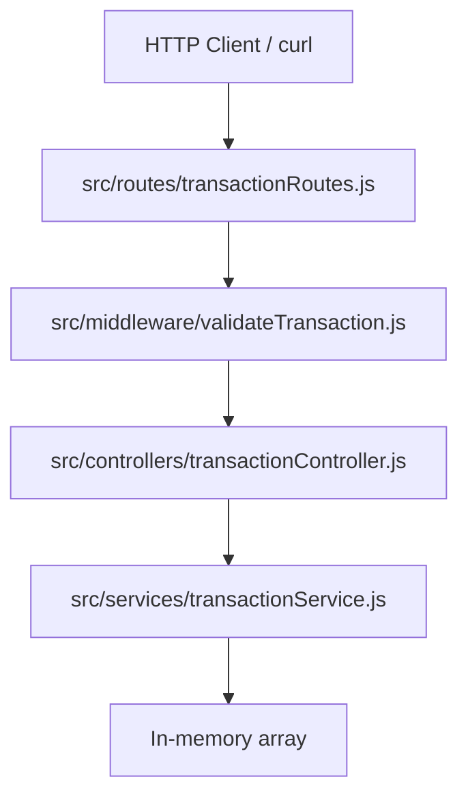

# B5 — Node.js Transaction API Report

**Repository:** `Evil-Ai`  
**Task location:** `beginner/B5-nodejs-api-cli/`  
**Report date:** 2026-06-17

---

## Executive Summary

A Node.js Express transaction API was built from scratch with layered architecture (routes → controllers → services), validation middleware, error handling, and Jest/Supertest tests. All **5 tests passed**. Live `curl` verification confirmed create, list, balance, and validation behavior.

| Metric | Result |
|--------|--------|
| Tests run | 5 |
| Passed | 5 |
| Failed | 0 |
| API endpoints verified | 3 (+ health) |
| **Overall result** | **PASS** |

---

## Architecture Overview



### Layer responsibilities

| Layer | File | Responsibility |
|-------|------|----------------|
| Entry | `src/server.js` | HTTP server bootstrap |
| App | `src/app.js` | Express setup, JSON parsing, route mounting |
| Routes | `src/routes/transactionRoutes.js` | HTTP method + path mapping |
| Middleware | `src/middleware/validateTransaction.js` | Request validation |
| Middleware | `src/middleware/errorHandler.js` | 404 + error responses |
| Controller | `src/controllers/transactionController.js` | Request/response handling |
| Service | `src/services/transactionService.js` | Business logic, balance calculation |
| Model | `src/models/transactionTypes.js` | Type constants |

---

## Folder Structure

```
beginner/B5-nodejs-api-cli/
├── src/
│   ├── app.js
│   ├── server.js
│   ├── routes/
│   │   └── transactionRoutes.js
│   ├── controllers/
│   │   └── transactionController.js
│   ├── services/
│   │   └── transactionService.js
│   ├── models/
│   │   └── transactionTypes.js
│   └── middleware/
│       ├── validateTransaction.js
│       └── errorHandler.js
├── tests/
│   └── transactions.test.js
├── package.json
├── README.md
└── .gitignore
```

---

## Endpoint Documentation

| Method | Path | Status | Request body | Response | Auth |
|--------|------|--------|--------------|----------|------|
| `POST` | `/transactions` | 201 | `{ type, amount, description? }` | Transaction object | None |
| `GET` | `/transactions` | 200 | — | Array of transactions | None |
| `GET` | `/balance` | 200 | — | `{ balance, transactionCount }` | None |
| `GET` | `/health` | 200 | — | `{ status: "ok" }` | None |

### Transaction response shape

```json
{
  "id": "uuid",
  "type": "credit | debit",
  "amount": 150,
  "description": "string | null",
  "createdAt": "ISO-8601"
}
```

### Balance response shape

```json
{
  "balance": 100,
  "transactionCount": 2
}
```

---

## Validation Rules

| Field | Rule | HTTP status |
|-------|------|-------------|
| `type` | Required | 400 |
| `type` | Must be `credit` or `debit` | 400 |
| `amount` | Required | 400 |
| `amount` | Must be a number | 400 |
| `amount` | Must be > 0 | 400 |
| `description` | Optional; must be string if provided | 400 |
| `description` | Empty/whitespace → `null` | — |

**Evidence — amount validation:**

```22:24:beginner/B5-nodejs-api-cli/src/middleware/validateTransaction.js
  } else if (amount <= 0) {
    errors.push({ field: 'amount', message: 'amount must be greater than 0' });
  }
```

**Evidence — balance calculation:**

```26:34:beginner/B5-nodejs-api-cli/src/services/transactionService.js
  getBalance() {
    const balance = this._transactions.reduce((total, transaction) => {
      if (transaction.type === TRANSACTION_TYPES.CREDIT) {
        return total + transaction.amount;
      }
      return total - transaction.amount;
    }, 0);
```

---

## Test Results

### Commands executed

```bash
cd beginner/B5-nodejs-api-cli
npm install
npm test
```

### Output

```
> b5-nodejs-api@1.0.0 test
> jest --runInBand

PASS tests/transactions.test.js
  Transaction API
    ✓ create transaction (139 ms)
    ✓ fetch transactions (5 ms)
    ✓ calculate balance (4 ms)
    ✓ invalid payload validation (5 ms)
    ✓ debit balance scenario (4 ms)

Test Suites: 1 passed, 1 total
Tests:       5 passed, 5 total
Time:        0.775 s
EXIT:0
```

| Test | Type | Result |
|------|------|--------|
| `create transaction` | Required | PASS |
| `fetch transactions` | Required | PASS |
| `calculate balance` | Required | PASS |
| `invalid payload validation` | Bonus | PASS |
| `debit balance scenario` | Bonus | PASS |

| Metric | Value |
|--------|------:|
| Exit code | 0 |
| Execution time | ~0.775s |
| Tests run | 5 |
| Passed | 5 |
| Failed | 0 |
| Skipped | 0 |

---

## Service Startup Proof

### Command

```bash
npm start
```

### Server log

```
> b5-nodejs-api@1.0.0 start
> node src/server.js

Transaction API listening on http://127.0.0.1:3000
```

---

## Curl Proof

### POST /transactions (credit)

```bash
curl -X POST http://127.0.0.1:3000/transactions \
  -H "Content-Type: application/json" \
  -d '{"type":"credit","amount":150.0,"description":"Initial deposit"}'
```

**Response (201):**

```json
{"id":"4575fe35-1315-4ffb-8726-017d53c502e2","type":"credit","amount":150,"description":"Initial deposit","createdAt":"2026-06-17T09:27:42.163Z"}
```

### POST /transactions (debit)

```bash
curl -X POST http://127.0.0.1:3000/transactions \
  -H "Content-Type: application/json" \
  -d '{"type":"debit","amount":50.0,"description":"Purchase"}'
```

**Response (201):**

```json
{"id":"e43496ab-7c62-470b-a562-2ab6b8b2c2e4","type":"debit","amount":50,"description":"Purchase","createdAt":"2026-06-17T09:27:42.179Z"}
```

### GET /transactions

```bash
curl http://127.0.0.1:3000/transactions
```

**Response (200):** 2 transactions returned.

### GET /balance

```bash
curl http://127.0.0.1:3000/balance
```

**Response (200):**

```json
{"balance":100,"transactionCount":2}
```

Balance verified: 150 − 50 = **100**.

### POST invalid amount

```bash
curl -X POST http://127.0.0.1:3000/transactions \
  -H "Content-Type: application/json" \
  -d '{"type":"credit","amount":-5}'
```

**Response (400):**

```json
{"error":"Validation failed","details":[{"field":"amount","message":"amount must be greater than 0"}]}
```

---

## API Verification Summary

| Endpoint | Method | HTTP status | Verified |
|----------|--------|-------------|----------|
| `/transactions` | POST | 201 | Yes |
| `/transactions` | GET | 200 | Yes |
| `/balance` | GET | 200 | Yes |
| `/transactions` (invalid) | POST | 400 | Yes |

---

## Comparison with B4 (FastAPI)

| Aspect | B4 (FastAPI) | B5 (Node.js) |
|--------|--------------|--------------|
| Framework | FastAPI | Express |
| Validation | Pydantic | Custom middleware |
| ID field | `created_at` | `createdAt` |
| Error status | 422 | 400 |
| Balance field | `transaction_count` | `transactionCount` |
| Test tool | pytest + TestClient | Jest + Supertest |

---

## Final Summary

| Field | Value |
|-------|-------|
| Framework | Express.js |
| Test framework | Jest + Supertest |
| Total test files | 1 |
| Total test cases | 5 |
| Test result | **PASS** |
| API verification | **PASS** |
| Confidence | **Confirmed** |
