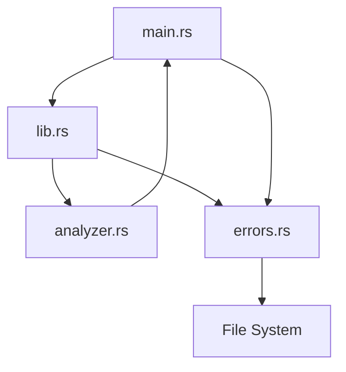

# B6 — Rust Log Analyzer CLI Report

**Repository:** `Evil-Ai`  
**Task location:** `beginner/B6-rust-cli/`  
**Report date:** 2026-06-17  
**Rust toolchain:** cargo 1.96.0

---

## Executive Summary

A Rust CLI log analyzer was built with modular architecture (`main` → `analyzer` + `errors`), custom error types with `Result` propagation, sample log files, and comprehensive tests. All **12 tests passed**. CLI execution verified correct summary output and missing-file error handling with non-zero exit code.

| Metric | Result |
|--------|--------|
| Build | PASS |
| Tests run | 12 |
| Passed | 12 |
| Failed | 0 |
| CLI sample run | PASS |
| Missing file handling | PASS (exit 1) |
| **Overall result** | **PASS** |

---

## Architecture Overview



### Module responsibilities

| Module | File | Responsibility |
|--------|------|----------------|
| CLI | `src/main.rs` | Parse args, orchestrate read → count → print, exit codes |
| Library | `src/lib.rs` | Export `analyzer` and `errors` modules |
| Analyzer | `src/analyzer.rs` | `count_log_levels`, `format_summary`, `LogCounts` |
| Errors | `src/errors.rs` | `LogAnalyzerError`, `read_log_file` with `Result` |

### Data flow

1. `main` reads file path from `std::env::args()`.
2. `read_log_file` returns `Result<String, LogAnalyzerError>`.
3. `count_log_levels` scans lines for `INFO` / `WARN` / `ERROR` prefixes.
4. `format_summary` produces markdown-style output to stdout.

---

## Cargo Project Structure

```
beginner/B6-rust-cli/
├── Cargo.toml
├── src/
│   ├── main.rs
│   ├── lib.rs
│   ├── analyzer.rs
│   └── errors.rs
├── tests/
│   └── log_analyzer_test.rs
├── logs/
│   ├── sample.log
│   └── empty.log
├── README.md
└── .gitignore
```

### Cargo.toml highlights

- Package: `b6-rust-log-analyzer`
- Library: `b6_rust_log_analyzer`
- Binary: `log-analyzer`
- Zero external runtime dependencies (stdlib only)

---

## CLI Design

### Usage

```bash
cargo run -- <log-file-path>
```

### Arguments

| Position | Name | Required | Description |
|----------|------|----------|-------------|
| 1 | `file_path` | Yes | Path to log file |

### Output format

```
## Log Summary

INFO: <count>
WARN: <count>
ERROR: <count>
```

**Evidence — summary formatting:**

```39:45:beginner/B6-rust-cli/src/analyzer.rs
pub fn format_summary(counts: &LogCounts) -> String {
    format!(
        "## Log Summary\n\nINFO: {}\nWARN: {}\nERROR: {}",
        counts.info, counts.warn, counts.error
    )
}
```

---

## Error Handling Strategy

Custom `LogAnalyzerError` enum implements `Display` and `std::error::Error`:

| Variant | Trigger | User message |
|---------|---------|--------------|
| `MissingArgument` | No CLI path | `Error: missing file path argument` |
| `FileNotFound` | Path does not exist | `Error: File not found: {path}` |
| `ReadPermissionDenied` | `PermissionDenied` IO error | `Error: Permission denied reading file: {path}` |
| `ReadFailed` | Other IO errors | `Error: Failed to read file {path}: {source}` |

**Evidence — file not found:**

```41:46:beginner/B6-rust-cli/src/errors.rs
pub fn read_log_file(path: &Path) -> Result<String, LogAnalyzerError> {
    if !path.exists() {
        return Err(LogAnalyzerError::FileNotFound(
            path.display().to_string(),
        ));
    }
```

**Evidence — non-zero exit on error:**

```11:15:beginner/B6-rust-cli/src/main.rs
fn main() {
    if let Err(error) = run() {
        eprintln!("{error}");
        process::exit(1);
    }
}
```

Empty files are handled gracefully — all counts return `0` with exit code `0`.

---

## Test Results

### Command

```bash
cargo test
```

### Output

```
running 6 tests (lib unit tests)
test analyzer::tests::count_error_logs ... ok
test analyzer::tests::count_info_logs ... ok
test analyzer::tests::count_warn_logs ... ok
test analyzer::tests::mixed_log_file ... ok
test analyzer::tests::empty_file ... ok
test analyzer::tests::format_summary_output ... ok

running 6 tests (integration tests)
test count_error_logs ... ok
test count_warn_logs ... ok
test count_info_logs ... ok
test missing_file ... ok
test mixed_log_file ... ok
test empty_file ... ok

test result: ok. 12 passed; 0 failed
EXIT:0
```

| Test | Location | Type | Result |
|------|----------|------|--------|
| `count_info_logs` | unit + integration | Required | PASS |
| `count_warn_logs` | unit + integration | Required | PASS |
| `count_error_logs` | unit + integration | Required | PASS |
| `missing_file` | integration | Bonus | PASS |
| `empty_file` | unit + integration | Bonus | PASS |
| `mixed_log_file` | unit + integration | Bonus | PASS |

| Metric | Value |
|--------|------:|
| Exit code | 0 |
| Unit tests | 6 |
| Integration tests | 6 |
| Total | 12 |
| Passed | 12 |
| Failed | 0 |

---

## Build Proof

### Command

```bash
cargo build
```

### Output

```
   Compiling b6-rust-log-analyzer v0.1.0
    Finished `dev` profile [unoptimized + debuginfo] target(s) in 0.91s
BUILD_EXIT:0
```

---

## Sample Execution Output

### Command

```bash
cargo run -- logs/sample.log
```

### Output

```
## Log Summary

INFO: 3
WARN: 1
ERROR: 1
```

**Exit code:** `0`

Matches expected counts from `logs/sample.log`:

```
INFO Application started
INFO User authenticated
WARN Rate limit approaching
ERROR Database connection failed
INFO Request processed
```

---

## Missing File Handling Proof

### Command

```bash
cargo run -- logs/missing.log
```

### Output (stderr)

```
Error: File not found: logs/missing.log
```

**Exit code:** `1`

---

## Commands Executed Summary

| Command | Exit code | Result |
|---------|----------:|--------|
| `cargo build` | 0 | Success |
| `cargo test` | 0 | 12/12 passed |
| `cargo run -- logs/sample.log` | 0 | Correct summary |
| `cargo run -- logs/missing.log` | 1 | Error message printed |

---

## Final Summary

| Field | Value |
|-------|-------|
| Language | Rust |
| Build tool | Cargo |
| External dependencies | None |
| Total test cases | 12 |
| Test result | **PASS** |
| CLI verification | **PASS** |
| Confidence | **Confirmed** |
