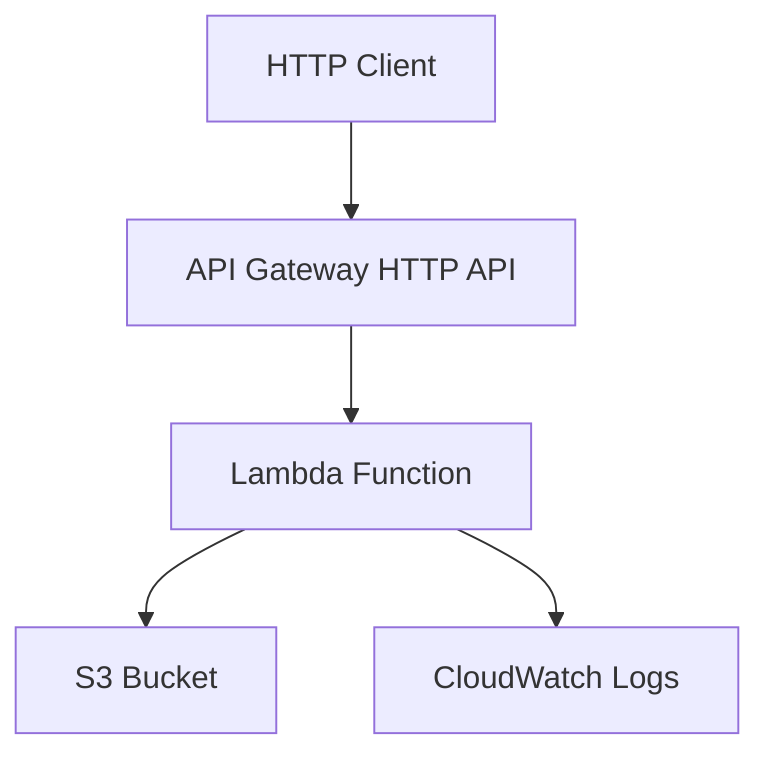

# D1 — Terraform Service Infrastructure

Terraform project for a small **AWS serverless API** using **Option A** architecture:

```
API Gateway (HTTP API) → Lambda (Python) → S3 Bucket
```

State is stored in a **local backend** for evaluation and offline planning.

---

## Overview

| Item | Value |
|------|-------|
| **Architecture** | Option A — API Gateway + Lambda + S3 |
| **Backend** | `local` (`terraform.tfstate`) |
| **Terraform** | `>= 1.5.0` |
| **Providers** | `hashicorp/aws` ~> 5.0, `hashicorp/archive`, `hashicorp/random` |

The Lambda function serves `GET /health` and receives the S3 bucket name via environment variables. Lambda deployment artifacts are stored in the same S3 bucket.

---

## Architecture



**Resources (14 planned):**

- S3 bucket (+ versioning, encryption, public access block)
- S3 object (Lambda zip artifact)
- IAM role + inline policy
- Lambda function
- API Gateway HTTP API, integration, route, stage
- Lambda permission
- `random_id` (bucket name suffix)

---

## Prerequisites

- [Terraform](https://www.terraform.io/downloads) `>= 1.5.0`
- AWS credentials for **`terraform apply`** (not required for `validate` / offline `plan` in this repo)

This project configures the AWS provider with `skip_credentials_validation` so `terraform plan` can run locally without real AWS credentials.

---

## Quick start

```bash
cd devops/D1-terraform
cp terraform.tfvars.example terraform.tfvars   # optional
terraform init
terraform validate
terraform plan -var-file=terraform.tfvars.example
```

---

## Terraform Init

```bash
terraform init
```

Initializes the **local** backend and downloads provider plugins. Produces `.terraform.lock.hcl`.

---

## Validate

```bash
terraform validate
```

Expected: `Success! The configuration is valid.`

---

## Plan

```bash
terraform plan -var-file=terraform.tfvars.example
```

Expected: `Plan: 14 to add, 0 to change, 0 to destroy.`

---

## Apply

```bash
terraform apply -var-file=terraform.tfvars.example
```

**Requires valid AWS credentials.** Creates resources in the configured region.

---

## Destroy

```bash
terraform destroy -var-file=terraform.tfvars.example
```

Tears down all managed resources.

---

## Outputs

| Output | Description |
|--------|-------------|
| `bucket_name` | S3 bucket ID |
| `lambda_name` | Lambda function name |
| `lambda_arn` | Lambda function ARN |
| `api_url` | API Gateway invoke URL |
| `api_id` | API Gateway ID |
| `iam_role_name` | Lambda execution role name |

After apply:

```bash
terraform output api_url
```

---

## Variables

See `terraform.tfvars.example` and `variables.tf`. Required:

- `project_name`
- `environment` (`dev`, `staging`, `prod`, `test`)

---

## Files

| File | Purpose |
|------|---------|
| `providers.tf` | Version constraints + AWS provider |
| `backend.tf` | Local state backend |
| `variables.tf` | Input variables |
| `outputs.tf` | Output values |
| `main.tf` | Resource definitions |
| `lambda/index.py` | Lambda handler source |
| `docs/TERRAFORM_REPORT.md` | Verification evidence |

---

## Risk notes

- **Cost:** API Gateway, Lambda, and S3 incur AWS charges on apply
- **Security:** S3 public access blocked; IAM least-privilege for Lambda
- **State:** Local `terraform.tfstate` — not for team production use; migrate to S3 backend for shared state

See `docs/TERRAFORM_REPORT.md` for full validation output.
