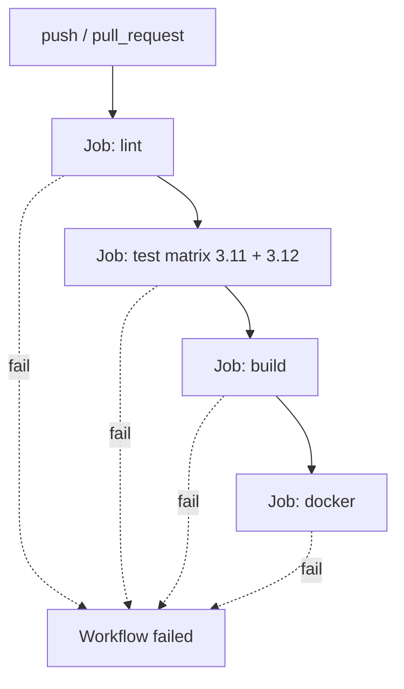

# Executive Summary

Task **D3** implements a complete CI pipeline for the **B4 FastAPI transaction service** using **GitHub Actions**. The workflow lint-checks, tests, verifies the application build, and produces a tagged Docker image on every push and pull request to `main`.

Local verification was executed via `devops/D3-ci-pipeline/scripts/run-pipeline-local.sh` (exit code **0**). Deliberate failure scenarios were captured for lint, test, and build stages (all exit code **1**). Docker build runs in GitHub Actions (`ubuntu-latest` provides Docker); the local environment had no Docker CLI.

---

# Selected Project

**`beginner/B4-fastapi-service`** — Transaction management API (FastAPI + pytest).

| Criterion | Why B4 |
|-----------|--------|
| Maturity | 8 passing pytest tests, health endpoint |
| Simplicity | Single Python service, clear `requirements.txt` |
| Docker fit | Slim Python image, no external DB required |
| Prior art | Already exercised in A4 root CI (test-only); D3 adds lint/build/docker |

Artifacts added for D3:

- `beginner/B4-fastapi-service/Dockerfile`
- `beginner/B4-fastapi-service/pyproject.toml` (ruff config)
- `.github/workflows/d3-ci.yml` (executable workflow at repo root)

---

# Pipeline Architecture



**Technology:** GitHub Actions  
**Workflow file:** `.github/workflows/d3-ci.yml`  
**Deliverable mirror:** `devops/D3-ci-pipeline/.github/workflows/ci.yml`

---

# Workflow Stages

## Lint

- **Runner:** `ubuntu-latest`
- **Tools:** `ruff check .`, `ruff format --check .`
- **Scope:** `beginner/B4-fastapi-service/app` and `tests`
- **Gate:** Must pass before test job runs

## Test

- **Tools:** `pytest -v --junitxml=test-results.xml`
- **Matrix:** Python **3.11** and **3.12** (see below)
- **Artifacts:** JUnit XML per matrix cell
- **Gate:** All matrix cells must pass before build

## Build

- **Tools:** `python -m compileall -q app`, import smoke test
- **Verifies:** Bytecode compiles and `app.main:app` loads
- **Gate:** Must pass before docker job

## Docker

- **Tools:** Docker Buildx + `docker/build-push-action@v6`
- **Context:** `beginner/B4-fastapi-service`
- **Tags:**
  - `b4-transaction-api:${{ github.sha }}`
  - `b4-transaction-api:latest`
- **Push:** `false` (build-only CI; no registry push in this eval)

---

# Cache Strategy

| Cache | Key components | Path / target |
|-------|----------------|---------------|
| pip (lint) | OS + `requirements.txt` + `pyproject.toml` hash | `~/.cache/pip` |
| pip (test) | OS + Python version + `requirements.txt` hash | `~/.cache/pip` |
| pip (build) | OS + `requirements.txt` hash | `~/.cache/pip` |
| Docker layers | OS + image name + Dockerfile + requirements hash | `/tmp/.buildx-cache` (buildx local cache) |

**Rationale:** Pip caches speed up repeated dependency installs across workflow runs. Buildx layer cache avoids rebuilding unchanged base layers when only application code changes.

**Restore keys:** Each cache defines prefix restore keys so partial cache hits still accelerate cold-ish starts.

---

# Matrix Strategy

| Dimension | Values | Rationale |
|-----------|--------|-----------|
| `python-version` | `3.11`, `3.12` | B4 targets modern Python; matrix catches version-specific typing/stdlib differences without doubling lint/build/docker cost |

Lint, build, and docker run once on 3.12/3.11 respectively to keep feedback fast while still validating runtime compatibility in test.

`fail-fast: false` on the test matrix so both versions report results even if one fails.

---

# Successful Run

## Commands

```bash
bash devops/D3-ci-pipeline/scripts/run-pipeline-local.sh
```

## Outputs

| Stage | Result | Exit code |
|-------|--------|-----------|
| lint-ruff-check | All checks passed | 0 |
| lint-ruff-format | 14 files already formatted | 0 |
| test-pytest | 8 passed | 0 |
| build-compile | OK | 0 |
| build-import | `build_ok title='Transaction Service'` | 0 |
| docker-build | Skipped locally (no Docker CLI); runs in GHA | 0 |

## Results

Full log: [PASSING_RUN.md](PASSING_RUN.md)

---

# Failure Mode Demonstration

## Commands

```bash
bash devops/D3-ci-pipeline/scripts/demo-failure.sh lint   # exit 1
bash devops/D3-ci-pipeline/scripts/demo-failure.sh test   # exit 1
bash devops/D3-ci-pipeline/scripts/demo-failure.sh build  # exit 1
```

## Outputs

| Mode | Failed stage | Exit code |
|------|--------------|-----------|
| lint | Lint (4 ruff errors) | 1 |
| test | Test (1 failed assertion) | 1 |
| build | Build (SyntaxError) | 1 |

## Results

Full log: [FAILING_RUN.md](FAILING_RUN.md)

---

# Docker Build Evidence

| Field | Value |
|-------|-------|
| Image name | `b4-transaction-api` |
| Tag (SHA) | `b4-transaction-api:677d449aa9bf07a26e9d579c84830ddae8e71e6d` (at verification time) |
| Tag (latest) | `b4-transaction-api:latest` |
| Dockerfile | `beginner/B4-fastapi-service/Dockerfile` |
| Base image | `python:3.11-slim` |
| Local build | Skipped — Docker CLI not installed |
| CI build | `docker` job on `ubuntu-latest` with Buildx + layer cache |

Expected successful CI step summary:

```text
## Docker build evidence
- Image: `b4-transaction-api:<sha>`
- Image: `b4-transaction-api:latest`
```

---

# Risk Assessment

## Build risks

- **Python version drift:** Matrix mitigates 3.11 vs 3.12 incompatibilities; production image pins 3.11-slim.
- **Unpinned upper bounds in requirements.txt:** `>=` ranges may pull breaking minors; consider lock file for production.

## Dependency risks

- **PyPI availability:** Transient install failures possible; pip cache reduces repeat exposure.
- **FastAPI/Starlette deprecations:** Tests emit `HTTP_422_UNPROCESSABLE_ENTITY` warnings; non-blocking today.

## Pipeline risks

- **No registry push:** Images are built but not published; deploy pipelines would need a separate push job + credentials.
- **Docker not verified locally:** Relies on GHA runner Docker; `act push` recommended when Docker Desktop is available.
- **Dual CI workflows:** Root `ci.yml` (A4 multi-service tests) and `d3-ci.yml` (B4 full pipeline) both run on push; acceptable overlap for eval, could path-filter later.
