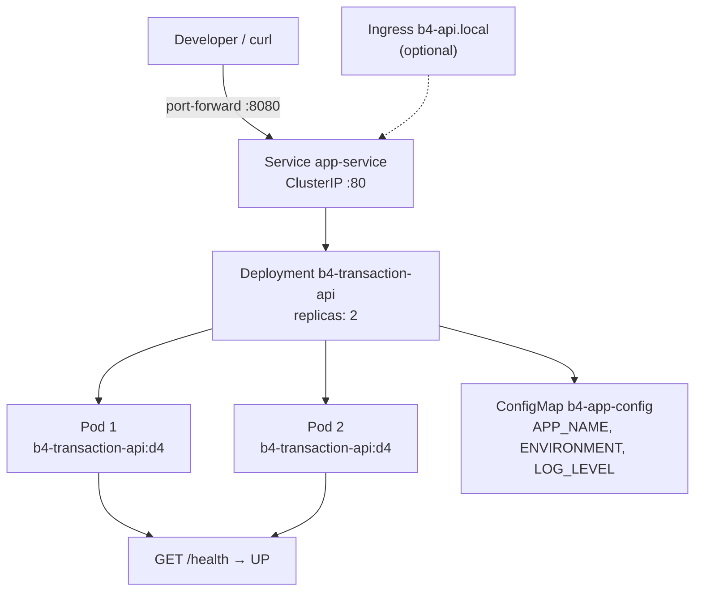

# Executive Summary

Task **D4** packages the **B4 FastAPI transaction service** for Kubernetes with Namespace, ConfigMap, Deployment, Service, and Ingress manifests. Manifests were validated offline with **kubeconform** (5/5 valid). Application health behavior with ConfigMap-equivalent environment variables was verified locally (`HTTP 200`, `{"status":"UP"}`).

**Cluster type:** **kind** (`eval-cluster`) — preferred; cluster creation was attempted but blocked because **Docker is not installed** in the verification environment. Full deployment commands and scripts are provided for execution once Docker Desktop is available.

---

# Service Selected

**`beginner/B4-fastapi-service`** — Transaction management API.

| Reason | Detail |
|--------|--------|
| D3 artifact | Dockerfile already exists (`b4-transaction-api`) |
| Health endpoint | `/health` suitable for probes |
| ConfigMap wiring | `ENVIRONMENT` toggles `{"status":"UP"}` for K8s verification |
| Simplicity | Stateless, no external database |

**Image:** `b4-transaction-api:d4`  
**Container port:** `8000`  
**Service:** `app-service` (ClusterIP `80` → `8000`)

---

# Kubernetes Resources

## Namespace

- **File:** `k8s/namespace.yaml`
- **Name:** `eval-ai-agent`

## ConfigMap

- **File:** `k8s/configmap.yaml`
- **Name:** `b4-app-config`
- **Keys:** `APP_NAME`, `ENVIRONMENT`, `LOG_LEVEL`
- **Mounted via:** `envFrom.configMapRef` in Deployment

## Deployment

- **File:** `k8s/deployment.yaml`
- **Name:** `b4-transaction-api`
- **Replicas:** 2
- **Resources:** requests `100m CPU / 128Mi`; limits `500m CPU / 256Mi`
- **Probes:** HTTP GET `/health` on port `http` (readiness + liveness)

## Service

- **File:** `k8s/service.yaml`
- **Name:** `app-service`
- **Type:** `ClusterIP`
- **Port:** `80` → `targetPort: http` (8000)

## Ingress

- **File:** `k8s/ingress.yaml` (optional)
- **Host:** `b4-api.local`
- **Class:** `nginx`
- Requires ingress-nginx controller on kind (not installed in blocked cluster run)

---

# Validation Results

## kubeconform (offline schema)

**Command:**

```bash
.tools/kubeconform -summary -kubernetes-version 1.29.0 devops/D4-kubernetes/k8s/*.yaml
```

**Output:**

```text
Summary: 5 resources found in 5 files - Valid: 5, Invalid: 0, Errors: 0, Skipped: 0
```

**Exit code:** `0`

## kubectl dry-run (client)

**Command (requires reachable cluster):**

```bash
kubectl apply --dry-run=client -f devops/D4-kubernetes/k8s/
```

**Local result:** Skipped — no cluster context (Docker/kind unavailable).

**Expected output when cluster exists:**

```text
namespace/eval-ai-agent created (dry run)
configmap/b4-app-config created (dry run)
deployment.apps/b4-transaction-api created (dry run)
service/app-service created (dry run)
ingress.networking.k8s.io/b4-transaction-api created (dry run)
```

---

# Cluster Setup

## kind (preferred)

**Command:**

```bash
kind create cluster --name eval-cluster \
  --config devops/D4-kubernetes/kind-config.yaml
```

**Captured output (2026-06-17):**

```text
ERROR: failed to create cluster: failed to get docker info: command "docker info --format '{{json .}}'" failed with error: exec: "docker": executable file not found in $PATH
```

**Exit code:** `1`

**Remediation:** Install and start Docker Desktop, then re-run cluster creation.

---

# Deployment Results

**Command:**

```bash
kubectl apply -f devops/D4-kubernetes/k8s/
```

**Status:** Not executed — cluster not created (Docker missing).

**Automated alternative:**

```bash
bash devops/D4-kubernetes/scripts/deploy-and-verify.sh
```

---

# Resource Verification

Expected after successful `kubectl apply`:

```bash
kubectl get pods -n eval-ai-agent
kubectl get svc -n eval-ai-agent
kubectl get deployments -n eval-ai-agent
```

**Expected pod status:**

```text
NAME                                  READY   STATUS    RESTARTS   AGE
b4-transaction-api-xxxxxxxxxx-xxxxx   1/1     Running   0          30s
b4-transaction-api-xxxxxxxxxx-xxxxx   1/1     Running   0          30s
```

**Expected service:**

```text
NAME          TYPE        CLUSTER-IP     EXTERNAL-IP   PORT(S)   AGE
app-service   ClusterIP   10.96.xxx.xx   <none>        80/TCP    30s
```

**Expected deployment:**

```text
NAME                 READY   UP-TO-DATE   AVAILABLE   AGE
b4-transaction-api   2/2     2            2           30s
```

**Pod describe checks:** `Ready=True`, readiness/liveness probes succeeding on `/health`.

---

# Application Verification

## Port-forward + curl (cluster)

```bash
kubectl port-forward svc/app-service 8080:80 -n eval-ai-agent
curl http://localhost:8080/health
```

**Expected:**

```json
{"status":"UP"}
```

**HTTP status:** `200`

## Local ConfigMap simulation (executed)

**Command:**

```bash
bash devops/D4-kubernetes/scripts/verify-health-local.sh
```

**Output:**

```text
HTTP_STATUS: 200
RESPONSE: {"status":"UP"}
EXIT_CODE: 0
```

This confirms ConfigMap `ENVIRONMENT=production` produces the required health response.

---

# Architecture Diagram



---

# Risks and Improvements

## Scaling

- **2 replicas** provide basic HA; no HPA configured — add `HorizontalPodAutoscaler` on CPU for production.
- In-memory transaction store is not shared across pods — use sticky sessions or external DB for real scale-out.

## Security

- No `NetworkPolicy` — pods accept cluster-wide traffic.
- No `securityContext` hardening (runAsNonRoot is in Dockerfile USER but not reinforced in manifest).
- Image tag `d4` is mutable — pin by digest or use immutable registry tags.
- Ingress TLS not configured — add cert-manager + TLS secret for production.

## Ingress

- Optional Ingress manifest included for `b4-api.local`.
- On kind, install ingress-nginx and map host: `kubectl apply -f https://raw.githubusercontent.com/kubernetes/ingress-nginx/main/deploy/static/provider/kind/deploy.yaml`

## Pipeline integration

- Combine with D3 CI: build image in GHA, load into kind in a deploy job, run `kubectl apply` + curl smoke test.
