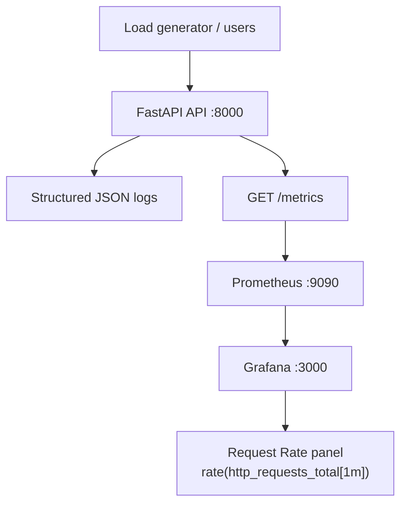

# Executive Summary

Task **D6** bolts observability onto the **B4 FastAPI transaction service** with structured JSON logging, a Prometheus `/metrics` endpoint, and a Docker Compose monitoring stack (Prometheus + Grafana). Local verification confirmed metrics increment under synthetic load (212 requests, all metric series present). Full Prometheus/Grafana verification requires Docker (`docker compose up -d`).

---

# Service Selected

**`beginner/B4-fastapi-service`** — copied and instrumented at `devops/D6-observability/service/`.

| Reason | Detail |
|--------|--------|
| Prior work | D3 Dockerfile, D4 K8s health probes |
| Simplicity | Stateless REST API, existing pytest suite |
| Traffic patterns | Multiple endpoints for meaningful dashboards |

---

# Logging Enhancements

## Files changed

| File | Change |
|------|--------|
| `service/app/middleware/observability.py` | **New** — JSON access logs + Prometheus instrumentation |
| `service/app/main.py` | Middleware registration, `/metrics` route |
| `service/requirements.txt` | Added `prometheus-client` |

## Library

Python standard `logging` + `json.dumps` (no structlog dependency).

## Sample logs

```json
{"timestamp":"2026-06-17T11:09:12.826227+00:00","method":"GET","path":"/health","status":200,"latency_ms":4.51,"request_id":"fd70a8bd-1a78-4dc7-89de-fb6e15f9fd4a"}
{"timestamp":"2026-06-17T11:09:12.898439+00:00","method":"POST","path":"/transactions","status":201,"latency_ms":2.54,"request_id":"e639fd5d-cf37-40d5-b483-9a47ab507b1b"}
```

Each response includes `X-Request-ID` header.

---

# Metrics Added

| Metric | Type |
|--------|------|
| `http_requests_total` | Counter |
| `http_request_duration_seconds` | Histogram |
| `request_count_by_endpoint` | Counter |
| `error_count` | Counter |

---

# Prometheus Configuration

**File:** `monitoring/prometheus/prometheus.yml`

```yaml
scrape_configs:
  - job_name: b4-transaction-api
    metrics_path: /metrics
    static_configs:
      - targets: ['api:8000']
```

Scrape interval: **5s**. Target discovered via Docker Compose service name `api` on network `d6-observability`.

---

# Grafana Dashboard

**Provisioned files:**

- `monitoring/grafana/provisioning/datasources/prometheus.yml` — Prometheus at `http://prometheus:9090`
- `monitoring/grafana/provisioning/dashboards/dashboard.yml` — file provider
- `monitoring/grafana/dashboards/api-observability.json` — dashboard export

## Panels

| Panel | PromQL |
|-------|--------|
| **Request Rate** (primary) | `sum(rate(http_requests_total[1m]))` |
| Request Count by Endpoint | `sum by (endpoint) (request_count_by_endpoint)` |
| Error Count | `sum(error_count)` |
| P95 Request Latency | `histogram_quantile(0.95, sum by (le) (rate(http_request_duration_seconds_bucket[1m])))` |

**Export copy:** `docs/DASHBOARD_EXPORT.json`

---

# Verification Results

| Step | Status | Evidence |
|------|--------|----------|
| Structured logging | PASS | JSON lines in `/tmp/d6-api.log` |
| `/metrics` endpoint | PASS | All 4 metric families present |
| pytest (9 tests) | PASS | exit 0 |
| Traffic generator | PASS | 212 requests in 15s |
| Metrics increase | PASS | `http_requests_total` 1 → 214+ |
| `verify_metrics.sh` | PASS | metrics endpoint checks |
| `docker compose up` | BLOCKED | Docker not installed |
| Prometheus scrape | Pending | Requires Docker stack |
| Grafana live panel | Pending | Requires Docker stack |

---

# Architecture Diagram



---

# Future Improvements

1. **OpenTelemetry tracing** — distributed traces across D2/D6 services
2. **Alertmanager** — alert on error rate and p95 latency SLOs
3. **Log aggregation** — ship JSON logs to Loki/ELK
4. **RED/USE dashboards** — rate, errors, duration by route template (not raw path)
5. **CI smoke test** — `docker compose up` + `verify_metrics.sh` in GitHub Actions
