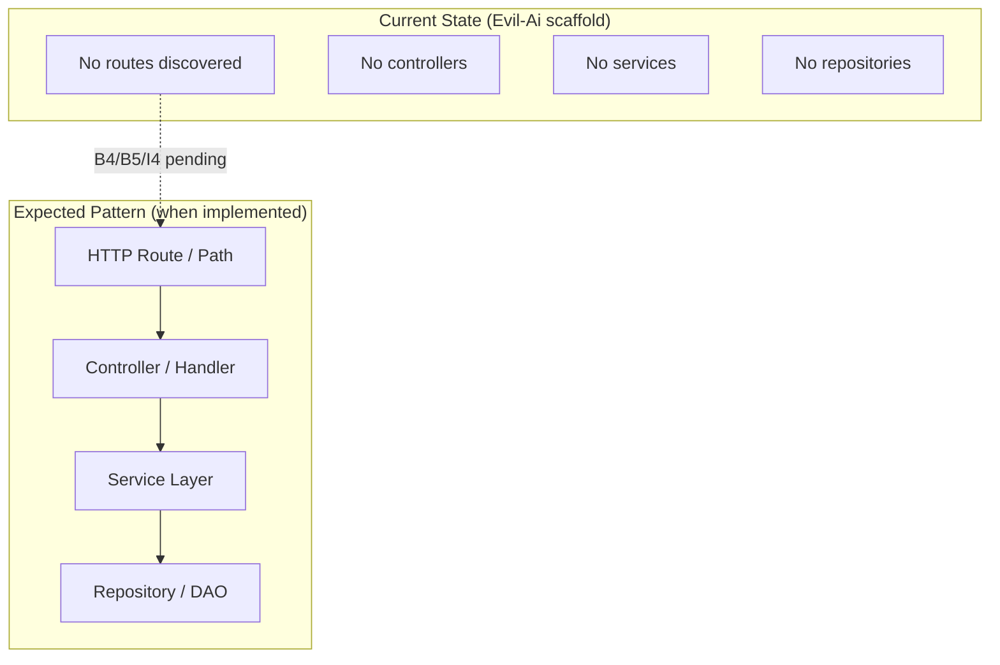
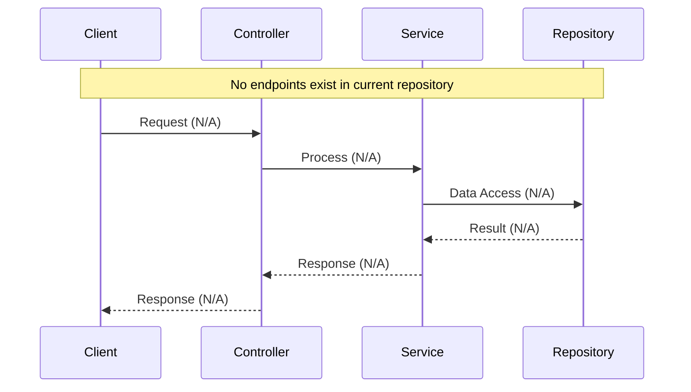

# B2 — API Endpoint Map

**Repository:** `Evil-Ai` (Eval AI Agent scaffold)  
**Scan date:** 2026-06-17  
**Scanner scope:** Full recursive scan from repository root, excluding `.git/` internals  
**Task output:** `docs/beginner/B2-api-endpoint-map/`

---

## Executive Summary

A complete recursive scan of the `Evil-Ai` repository found **zero externally exposed API routes**, **zero frontend routes**, **zero webhooks**, **zero GraphQL endpoints**, and **zero WebSocket endpoints**.

The repository contains no application source code — only scaffold directories, documentation from prior tasks (B1), and placeholder `.gitkeep` files. No REST controllers, route decorators, OpenAPI/Swagger specs, gateway configs, ingress definitions, or frontend routing files were detected.

| Metric | Count |
|--------|------:|
| **Total APIs discovered** | **0** |
| **Total frontend routes** | **0** |
| **Total webhooks** | **0** |
| **Total GraphQL endpoints** | **0** |
| **Total WebSocket endpoints** | **0** |
| **Total gateway routes** | **0** |
| **Total health check endpoints** | **0** |
| **Public endpoints** | **0** |
| **Secured endpoints** | **0** |

**Conclusion:** No endpoint inventory is possible at this time. Future tasks (e.g. `beginner/B4-fastapi-service/`, `beginner/B5-nodejs-api-cli/`, `intermediate/I4-fastapi-node-pair/`, `devops/D2-docker-compose/`) are expected to introduce routable services; this map should be re-run after code is added.

---

## Scan Methodology

| Step | Action | Patterns / Targets | Result |
|------|--------|-------------------|--------|
| 1 | File inventory | All files excluding `.git/` | **29** files |
| 2 | Source file detection | `*.java`, `*.py`, `*.ts`, `*.tsx`, `*.js`, `*.jsx`, `*.go`, `*.rs`, `*.kt`, `*.rb`, `*.cs`, `*.php`, `*.vue`, `*.svelte` | **0** matches |
| 3 | Config / spec detection | `*.yaml`, `*.yml`, `*.json`, `*.toml`, `*.xml`, `*.properties`, OpenAPI/Swagger | **0** matches |
| 4 | REST route patterns | `@GetMapping`, `@PostMapping`, `@RestController`, `router.get/post`, `app.get/post`, `@app.route`, `APIRouter`, `FastAPI` route defs | **0** application matches |
| 5 | GraphQL patterns | `graphql`, `GraphQLSchema`, `@Query`, `@Mutation`, `apollo` | **0** matches |
| 6 | WebSocket patterns | `WebSocket`, `@SubscribeMessage`, `ws://`, `socket.io` | **0** matches |
| 7 | Frontend route patterns | `react-router`, `createBrowserRouter`, `next/router`, `vue-router`, `path:` route configs | **0** matches |
| 8 | Gateway / ingress patterns | `ingress`, `nginx.conf`, `api-gateway`, Kong/Envoy route defs | **0** matches |
| 9 | Webhook / callback patterns | `webhook`, `callback`, `/hooks/` | **0** matches |
| 10 | Health check patterns | `/health`, `/healthz`, `/ready`, `/live`, `actuator/health` | **0** matches |

### Evidence — no runnable services

The root README confirms this is an exercise scaffold with implementations deferred to per-task folders:

```53:54:README.md
1. Pick a task folder (e.g. `beginner/B4-fastapi-service/`).
2. Add your code and any notes for that exercise.
```

B1 inventory (prior task) independently confirmed **0 source files** and **0 controllers/services**:

```14:16:docs/beginner/B1-repo-artifact-inventory/REPORT.md
A complete recursive scan of the `Evil-Ai` repository found **no application source code** and **zero artifacts** in any of the requested software categories (classes, interfaces, controllers, services, models/entities, repositories/DAOs, jobs, consumers/listeners, configuration classes, utilities, middleware/filters, or validators).
```

---

## API Inventory

No endpoints discovered. The table below is empty.

| HTTP Method | Route Path | Type | Controller/Class | Handler Method | Request DTO | Response DTO | Auth | Source File | Confidence |
|-------------|------------|------|----------------|----------------|-------------|--------------|------|-------------|------------|
| — | — | — | — | — | — | — | — | — | — |

*Machine-readable export: `endpoints.csv` (header row only, zero data rows).*

---

## Authentication Analysis

With no discovered endpoints, authentication posture cannot be assessed from code.

| Category | Count | Endpoints |
|----------|------:|-----------|
| Public endpoints | 0 | — |
| Authenticated endpoints | 0 | — |
| Role-protected endpoints | 0 | — |

**Note:** No security middleware, JWT filters, OAuth configs, API keys, or `@PreAuthorize` / `Depends()` guards were found in source (no source exists).

---

## Route Grouping

No feature modules expose routes. Planned exercise slots that may introduce APIs in future tasks:

| Module / Slot | Track | Expected API Technology (from README) | Routes Found |
|---------------|-------|--------------------------------------|-------------:|
| `beginner/B4-fastapi-service/` | Beginner | FastAPI (Python) | 0 |
| `beginner/B5-nodejs-api-cli/` | Beginner | Node.js API / CLI | 0 |
| `beginner/B6-rust-cli/` | Beginner | Rust CLI (may not expose HTTP) | 0 |
| `intermediate/I4-fastapi-node-pair/` | Intermediate | FastAPI + Node.js pair | 0 |
| `intermediate/I5-dockerize/` | Intermediate | Containerized services | 0 |
| `devops/D2-docker-compose/` | DevOps | Compose-exposed ports | 0 |
| `devops/D4-kubernetes/` | DevOps | K8s ingress / services | 0 |

*Technology labels above are **Inferred** from README task names only — no implementation files exist.*

---

## Dependency Mapping

No controller → service → repository chains exist because no controllers, services, or repositories were found.

| Controller | Service | Repository | Evidence |
|------------|---------|------------|----------|
| — | — | — | No source files |

---

## Route Architecture Diagram

No live route-to-controller-to-service chains exist. Diagram below shows the **expected** pattern for when APIs are implemented; all nodes are currently absent.



---

## Endpoint Flow Diagram

No request/response flows can be traced. Template sequence for future reference:



---

## Evidence Log

| # | Search Target | Files Examined | Matches | Classification |
|---|---------------|----------------|---------|----------------|
| 1 | Spring `@RequestMapping` family | 0 source files | 0 | Confirmed absent |
| 2 | Express / Fastify `app.get` / `router.*` | 0 source files | 0 | Confirmed absent |
| 3 | FastAPI `@app.get` / `APIRouter` | 0 source files | 0 | Confirmed absent |
| 4 | OpenAPI / Swagger specs | 0 spec files | 0 | Confirmed absent |
| 5 | GraphQL schema / resolvers | 0 source files | 0 | Confirmed absent |
| 6 | WebSocket handlers | 0 source files | 0 | Confirmed absent |
| 7 | React / Next / Vue router configs | 0 frontend files | 0 | Confirmed absent |
| 8 | Nginx / Traefik / K8s Ingress | 0 config files | 0 | Confirmed absent |
| 9 | Docker Compose `ports` exposing APIs | 0 compose files | 0 | Confirmed absent |
| 10 | Terraform ALB / API Gateway | 0 `.tf` files | 0 | Confirmed absent |

---

## Notable Findings

1. **Scaffold-only — no HTTP surface.** The repository cannot accept or route HTTP traffic in its current state.

2. **B2 slot is empty.** `beginner/B2-api-endpoint-map/` contains only `.gitkeep`; deliverables live under `docs/beginner/B2-api-endpoint-map/` per task spec.

3. **`.gitignore` anticipates future APIs** but none are implemented:

   ```31:40:.gitignore
   # Node / JavaScript
   node_modules/
   ...
   .next/
   .nuxt/
   ```

4. **No API documentation artifacts** — no `openapi.yaml`, `swagger.json`, Postman collections, or route tables in docs (aside from this B2 report).

5. **Cross-validation with B1** — consistent zero-artifact result across independent scans.

---

## Areas Requiring Manual Verification

| # | Area | Reason |
|---|------|--------|
| 1 | Gitignored runtime configs | `.env`, local compose overrides, or `node_modules/` may contain route refs not on disk |
| 2 | External API gateway | Routes may be defined outside this repo (separate infra repo) |
| 3 | Uncommitted local code | Artifacts not saved to disk would be missed |
| 4 | Submodule / monorepo siblings | No submodules detected; verify if eval target is a different repo |
| 5 | CLI-only interfaces | `B5-nodejs-api-cli` and `B6-rust-cli` may expose commands rather than HTTP — re-classify when implemented |

---

## Verification Summary

| Metric | Verified Value |
|--------|---------------:|
| **Total API endpoints** | **0** |
| **Total frontend routes** | **0** |
| **Public endpoints** | **0** |
| **Secured endpoints** | **0** |
| **Total webhooks** | **0** |
| **Total GraphQL endpoints** | **0** |
| **Total WebSocket endpoints** | **0** |
| **Top modules exposing APIs** | *None* |

---

## Appendix — Files Scanned (non-`.git`)

All **29** repository files were included in scope. None contain route definitions:

- `.gitignore`, `README.md`
- `docs/beginner/B1-repo-artifact-inventory/REPORT.md`, `inventory.csv`
- `docs/.gitkeep`
- 25× `**/.gitkeep` across `beginner/`, `intermediate/`, `advanced/`, `devops/`
