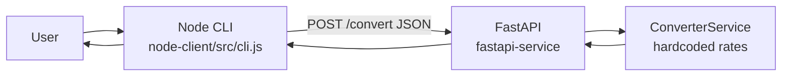
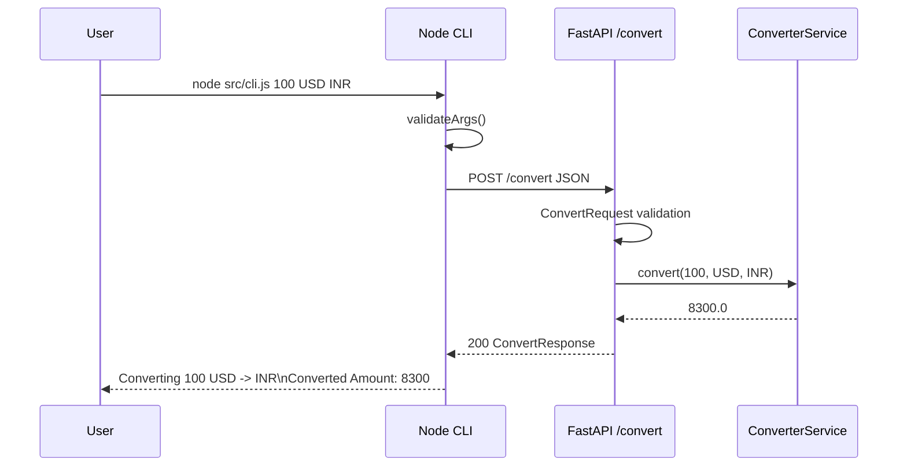

# I4 — Polyglot Service Pair Report

**Repository:** `Evil-Ai`  
**Location:** `intermediate/I4-polyglot-service-pair/`  
**Date:** 2026-06-17

---

# Executive Summary

A two-component polyglot system was built: a **FastAPI** currency conversion API (`POST /convert`) and a **Node.js CLI** client that calls it via HTTP. Hardcoded rates, input validation, tests, and end-to-end verification were completed successfully.

| Component | Tests | E2E | Result |
|-----------|------:|-----|--------|
| FastAPI service | 4 passed | curl verified | **PASS** |
| Node.js CLI | 5 passed | live call verified | **PASS** |

---

# Architecture



---

# Data Contract

## Request format

```json
{
  "amount": 100,
  "from_currency": "USD",
  "to_currency": "INR"
}
```

## Response format

```json
{
  "amount": 100,
  "from_currency": "USD",
  "to_currency": "INR",
  "converted_amount": 8300
}
```

## Error format

- **422** — Pydantic validation (`{"detail": [...]}`)
- **400** — Unsupported currency pair (`{"detail": "No conversion rate defined for ..."}`)

---

# FastAPI Service

## Endpoint

| Method | Path | Status | Description |
|--------|------|--------|-------------|
| `POST` | `/convert` | 200 | Convert amount between currencies |
| `GET` | `/health` | 200 | Health check |

## Validation rules

| Field | Rule |
|-------|------|
| `amount` | Required, must be > 0 |
| `from_currency` | Required, `USD` \| `INR` \| `EUR` |
| `to_currency` | Required, `USD` \| `INR` \| `EUR` |
| Pair | Must exist in `CONVERSION_RATES` |

## Hardcoded rates

| From | To | Rate |
|------|-----|------|
| USD | INR | 83.0 |
| INR | USD | 0.012 |
| USD | EUR | 0.92 |
| EUR | USD | 1.08 |

---

# Node Client

## CLI usage

```bash
node src/cli.js 100 USD INR
```

## Error handling

- CLI argument validation before HTTP call
- Axios errors (`ECONNREFUSED`) → exit code 2
- API 4xx responses → exit code 1 with `detail` message

---

# Test Results

## Service

**Command:**

```bash
cd fastapi-service
source .venv/bin/activate
pytest -v
```

**Output:**

```
tests/test_convert.py::test_valid_conversion PASSED
tests/test_convert.py::test_invalid_currency PASSED
tests/test_convert.py::test_invalid_amount PASSED
tests/test_convert.py::test_unsupported_currency_pair PASSED
4 passed
PYTEST_EXIT:0
```

**Result:** **PASS**

## Client

**Command:**

```bash
cd node-client
npm test
```

**Output:**

```
PASS tests/client.test.js
  ✓ successful conversion formatting
  ✓ validation failure for invalid amount
  ✓ API unavailable scenario
  ✓ validation failure for unsupported currency
  ✓ uses default API base URL
5 passed
NPM_TEST_EXIT:0
```

**Result:** **PASS**

---

# End-to-End Verification

## Flow

```
User runs: node src/cli.js 100 USD INR
  → CLI validates args
  → POST http://127.0.0.1:8002/convert
  → FastAPI validates ConvertRequest
  → ConverterService.convert(100, USD, INR)
  → 100 * 83 = 8300
  → ConvertResponse JSON
  → CLI prints formatted output
```

## Sequence diagram



## E2E evidence

### Successful conversion

```bash
CONVERTER_API_URL=http://127.0.0.1:8002 node src/cli.js 100 USD INR
```

```
Converting 100 USD -> INR
Converted Amount: 8300
EXIT:0
```

### Invalid input (CLI)

```bash
node src/cli.js -5 USD INR
```

```
Error: amount must be a number greater than 0
EXIT:1
```

### API unavailable

```bash
CONVERTER_API_URL=http://127.0.0.1:59999 node src/cli.js 100 USD INR
```

```
Error: Currency conversion service is unavailable
EXIT:2
```

### Direct API (curl)

```bash
curl -X POST http://127.0.0.1:8002/convert \
  -H "Content-Type: application/json" \
  -d '{"amount":100,"from_currency":"USD","to_currency":"INR"}'
```

```json
{"amount":100.0,"from_currency":"USD","to_currency":"INR","converted_amount":8300.0}
```

---

# Validation Checklist

| # | Check | Result |
|---|-------|--------|
| 1 | FastAPI tests pass | **Pass** (4/4) |
| 2 | CLI communicates with API | **Pass** |
| 3 | Invalid input handled | **Pass** |
| 4 | Service failure handled | **Pass** (exit 2) |
| 5 | README instructions work | **Pass** |

---

# Final Summary

| Field | Value |
|-------|-------|
| FastAPI tests | 4/4 passed |
| Node tests | 5/5 passed |
| E2E conversion | Verified |
| Confidence | **Confirmed** |
